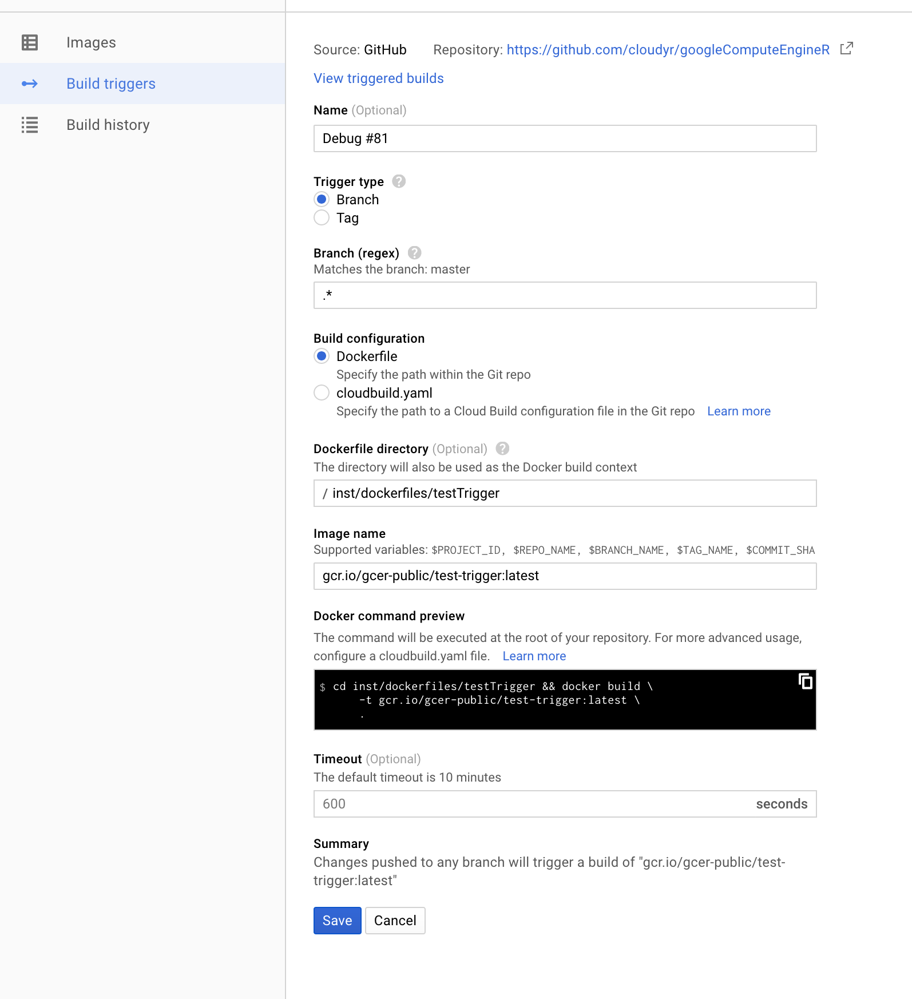
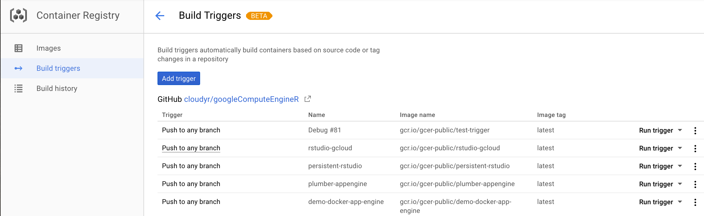
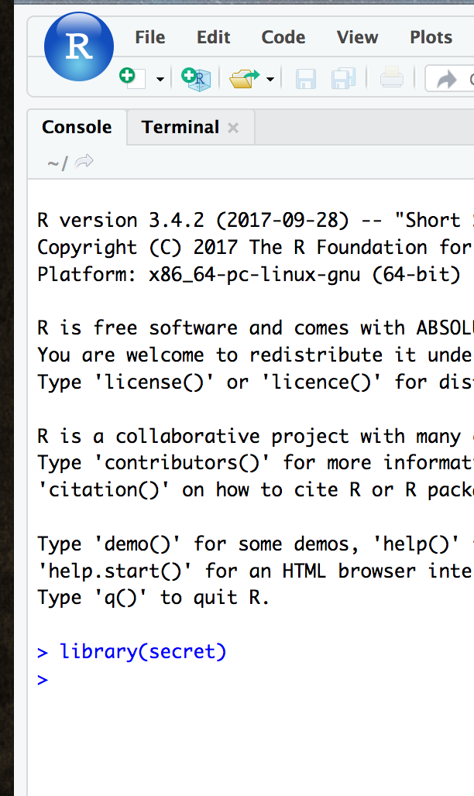

## Dockerfiles

`googleComputeEngineR` has a lot of integration with [`Docker`](https://www.docker.com/), using it to launch custom pre-made images via the `gce_vm_container` and `gce_vm_template` commands. 

Get an overview on how to [install containers on Google Compute Engine here](https://cloud.google.com/compute/docs/containers/deploying-containers).

Use `Dockerfiles` to create the VM you want to run within, including R packages you want to install.  As an example, this is a Dockerfile designed to install R packages for a Shiny app:

```sh
FROM rocker/shiny
MAINTAINER Mark Edmondson (r@sunholo.com)

# install R package dependencies
RUN apt-get update && apt-get install -y \
    libssl-dev \
    ## clean up
    && apt-get clean \ 
    && rm -rf /var/lib/apt/lists/ \ 
    && rm -rf /tmp/downloaded_packages/ /tmp/*.rds
    
## Install packages from CRAN
RUN install2.r --error \ 
    -r 'http://cran.rstudio.com' \
    googleAuthR \
    && Rscript -e "devtools::install_github(c('MarkEdmondson1234/googleID')" \
    ## clean up
    && rm -rf /tmp/downloaded_packages/ /tmp/*.rds

## assume shiny app is in build folder /shiny
COPY ./shiny/ /srv/shiny-server/myapp/

```

The `COPY` command copies from a folder in the same location as the `Dockerfile`, and then places it within the `/srv/shiny-server/` folder which is the default location for Shiny apps.  This location means that the Shiny app will be avialable at `xxx.xxx.xxx.xxx/myapp/`

The example Dockerfile above installs `googleAuthR` from CRAN, `googleID` from GitHub and a Debian dependency for `googleAuthR` that is needed, `libssl-dev` via `apt-get`.  Modify this for your own needs. 

## Google Container Registry

Google Cloud comes with a [private container registry](https://cloud.google.com/container-registry/) where you can store public or private docker containers.  It is distinct from the more usual Docker hosted hub, where most public Docker images sit.

Container names usually come in the format `gcr.io/your-project-id/your-image-id`

You can use this directly or create the correct name for a hosted image via `gce_tag_container()` - by default it uses the project you are in, but change the project name if necessary, for example for the public images available in `gcer-public` at this URL: `https://console.cloud.google.com/gcr/images/gcer-public?project=gcer-public`

Access and push to your registry via the `gce_pull_registry()` and `gce_push_registry()` functions. 

You can use this to save a custom image with your specific dependencies, which can then also be used as a base for other custom images. 

## Build Triggers

Build triggers are a feature of the [Google Container Registry](https://cloud.google.com/container-registry/), which lets you build the docker image when you push to a public or private Git repository such as GitHub or Bitbucket. 

A typical workflow is to construct your Dockerfile locally, push to say GitHub which [triggers a build](https://cloud.google.com/container-builder/docs/concepts/creating-build-triggers), then use that build when launching a VM via the `dynamic_image` argument in `gce_vm()`.

This lets you use version control on your R environments, and provides a useful way to always know exactly what dependencies are running.  The VMs built using your dynamic image can be stopped with their Docker versions intact, and you can try out new development versions by launching another VM. 

### Build Trigger Setup example

1. The example Dockerfile is a simple one that uses a Tidyverse Docker image (this has RStudio as well) and installs `secret`.  Customise this to your needs, perhaps by creating your own Dockerfile with help from [`containerit`](https://github.com/o2r-project/containerit)

```
FROM rocker/tidyverse

# Install secret
RUN install2.r --error \
        secret 
```

2. The Dockerfile is pushed to GitHub (this example is in the googleComputeEngineR GitHub [here](https://github.com/cloudyr/googleComputeEngineR/tree/master/inst/dockerfiles/testTrigger))
3. Login to the Google Cloud console and visit [Build triggers](https://console.cloud.google.com/gcr/triggers), and make a trigger with these settings:



Note the image name, folder to build from and that the tag is set to latest.

This should then shown in the build trigger console like this:



This is in the public googleComputeEngineR image project, but should look similar for your own.

4. We now launch the VM with the custom image.  Since it is an RStudio based template, we define template to be "rstudio" and supply a username and password.  If it was a Shiny based Dockerfile, the template would be changed to "shiny", etc.

```r
library(googleComputeEngineR)
## auto auth messages
## set default project ID to xxxxxx
## set default zone to xxxxx

vm <- gce_vm("im-rstudio", 
              predefined_type = "n1-standard-1", 
              template = "rstudio", 
              username = "test", 
              password = "test1234", 
              dynamic_image = gce_tag_container("test-trigger", project = "gcer-public"))
```

Note I change the project to the public one of the image, as its different from the paid project I put the VM into, but in your case it may be the same.

The Dockerfile name is given by the `gce_tag_container()` function. 

```r
gce_tag_container("test-trigger", project = "gcer-public")
# [1] "gcr.io/gcer-public/test-trigger"
```

You can use this function or pass in the image name directly as listed in the Build trigger console.

4. After a few mins visit the I.P. of the instance which should have RStudio running with the secret library installed:



## Public Docker images

The `FROM` field in the `Dockerfile` could be a previously made image you or someone else has already created, allowing you to layer on top.  The first example above is available via a public Google Continer Registry called `gcer-public`, made for this purpose, which you can see here: `https://console.cloud.google.com/gcr/images/gcer-public?project=gcer-public`


One example is `shiny-googleauthrdemo` - to construct the correct name we need this and the `gcer-public`project Id to use within the  `gce_tag_container()` function:

```r
library(googleComputeEngineR)
gce_tag_container("shiny-googleauthrdemo", project = "gcer-public")
# gcr.io/gcer-public/shiny-googleauthrdemo
```

This can then be added to to top of your `Dockerfile`, and built upon with custom packages:

```sh
FROM gcr.io/gcer-public/shiny-googleauthrdemo
MAINTAINER Mark Edmondson (r@sunholo.com)

# install R package dependencies
RUN apt-get update && apt-get install -y \
    ##### ADD YOUR DEPENDENCIES
    ## clean up
    && apt-get clean \ 
    && rm -rf /var/lib/apt/lists/ \ 
    && rm -rf /tmp/downloaded_packages/ /tmp/*.rds
    
## Install packages from CRAN
RUN install2.r --error \ 
    -r 'http://cran.rstudio.com' \
    ##### ADD YOUR CRAN PACKAGES
    ##### && Rscript -e "devtools::install_github( ## ADD YOUR GITHUB PACKAGES )" \
    ## clean up
    && rm -rf /tmp/downloaded_packages/ /tmp/*.rds

## copy your shiny app folder below
COPY ./shiny/ /srv/shiny-server/myapp/
```

Hopefully more images can be added in the future, along with community contributions.  They are rebuilt every commit to the `googleComputeEngineR` GitHub repo. 

## Saving a running container to the container registry

If not building via `Dockerfile` (which is preferred), you can save the state of a running container.

For example, you may wish to install some R packages manually to an RStudio instance via its terminal window. Once done, then on your local machine you can save the running container to a new image on Google container registry via `gce_save_container`.

This can take some time (10mins +) if its a new image. You should be able to see the image in the web UI when it is done.
 
```r
gce_save_container(vm, "my-rstudio")
```

Once saved, the new image can be used to launch new containers just like any other image.

## Cloud Init

If you want to customise further, the docker commands are triggered upon start up via [`cloud-init`](https://cloudinit.readthedocs.io/en/latest/) files.  

These can be used to configured to do more system level commands such as starting the docker service, create users and running start up scripts.  These are accessible via the `gce_vm_container` function when you supply the `cloud_init` file. You can examine the `cloud-config` files used in `googleComputeEngineR` in this folder: 

```r
system.file("cloudconfig", package = "googleComputeEngineR")
```

An example for the RStudio template is shown below.  The `%s` are replaced with metadata passed via the `gce_vm_create` function. 

```sh
#cloud-config

users:
- name: gcer
  uid: 2000

write_files:
- path: /etc/systemd/system/rstudio.service
  permissions: 0644
  owner: root
  content: |
    [Unit]
    Description=RStudio Server
    Requires=docker.service
    After=docker.service

    [Service]
    Restart=always
    Environment="HOME=/home/gcer"
    ExecStartPre=/usr/share/google/dockercfg_update.sh
    ExecStart=/usr/bin/docker run -p 80:8787 \
                                  -e "ROOT=TRUE" \
                                  -e "R_LIBS_USER=/library/" \
                                  -e USER=%s -e PASSWORD=%s \
                                  -v /home/gcer/library/:/library/ \
                                  --name=rstudio \
                                  %s
    ExecStop=/usr/bin/docker stop rstudio
    ExecStopPost=/usr/bin/docker rm rstudio

runcmd:
- systemctl daemon-reload
- systemctl start rstudio.service
```
