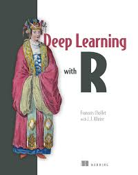
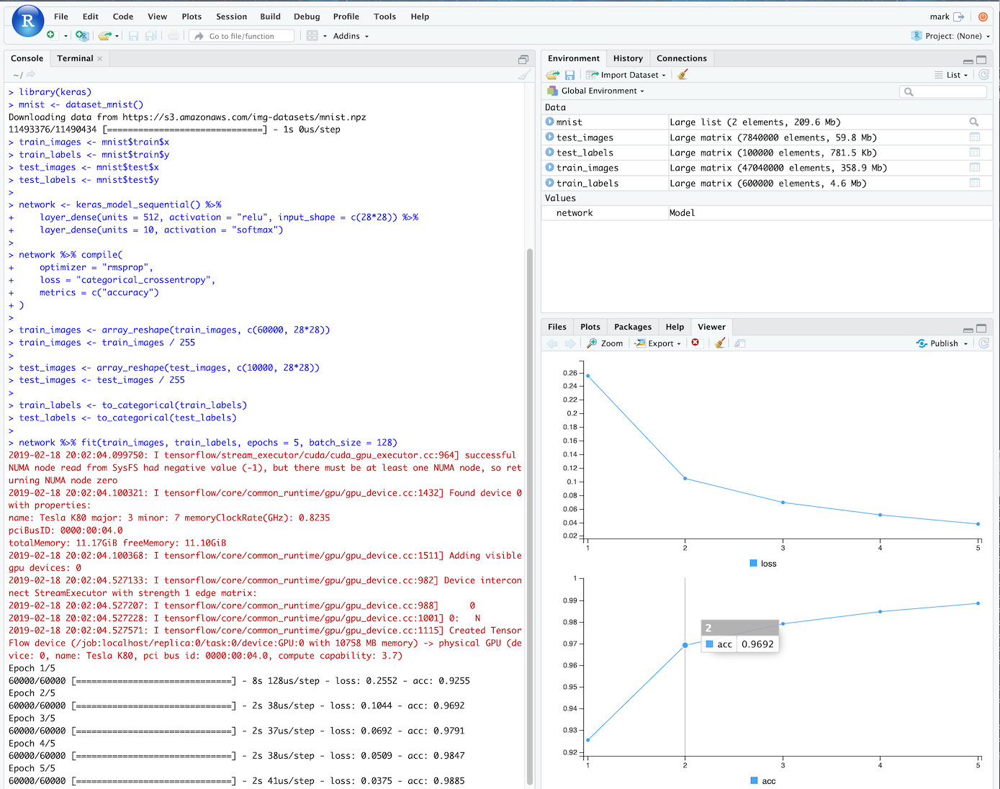

## GPUs

Google Compute Engine has support for launching instances with GPUs.

To use with `googleComputeEngineR` the main function is `gce_vm_gpu()` which will set some defaults for you before passing the arguments to `gce_vm()`:

If not specified, this function will enter defaults to get a GPU instance up and running using the [deep learning VM project as specified in this google article](https://cloud.google.com/deep-learning-vm/docs/cli)

Modify the defaults as you wish by passing them into the function.

* acceleratorCount: 1
* acceleratorType: "nvidia-tesla-p4"
* scheduling: list(onHostMaintenance = "TERMINATE", automaticRestart = TRUE)
* image_project: "deeplearning-platform-release"
* image_family: "tf-latest-cu92"
* predefined_type: "n1-standard-8"
* metadata: "install-nvidia-driver" = "True"

```r
vm <- gce_vm_gpu(name = "gpu")

# if you want most GPU units
vm <- gce_vm_gpu(name = "gpu", acceleratorCount = 4)
```

You can check the installation via `gpu_check_gpu()` which returns the output of the nvidia status command via SSH.

You can see the GPUs available for your project and zone via `gce_list_gpus()`

```r
gce_list_gpus(project="your-project")
#==Google Compute Engine GPU List==
#                   name                           description maximumCardsPerInstance           zone
#1      nvidia-tesla-k80                      NVIDIA Tesla K80                       8 europe-west1-b
#2     nvidia-tesla-p100                     NVIDIA Tesla P100                       4 europe-west1-b
#3 nvidia-tesla-p100-vws NVIDIA Tesla P100 Virtual Workstation                       4 europe-west1-b
#    creationTimestamp
#1 1969-12-31 16:00:00
#2 1969-12-31 16:00:00
#3 1969-12-31 16:00:00
```

GPUs are more restricted in the zones they are available than normal instances, you will get an error if you try to use a GPU outside a zone its available within.

From the above list, if you wanted to select another GPU you would then issue:

```r
vm <- gce_vm_gpu(name = "gpu", acceleratorCount = 4, acceleratorType = "nvidia-tesla-k80")
```

## Deeplearning for R - the rstudio-gpu template

Rocker.org has [deeplearning Docker images available at `rocker/ml`](https://github.com/rocker-org/ml) that install:

* NVIDIA GPU drivers via CUDA
* RStudio/R/Tidyverse
* Tensorflow
* Keras
* xgboost
* mxnet
* h20

This is an appropriate workstation to go through the ["Deep Learning with R" book by François Chollet and J.J. Allaire](https://www.manning.com/books/deep-learning-with-r).



A template for `gce_vm()` is setup to launch the above image with GPU support for `nvidia-tesla-p4`.  It uses `gce_vm_gpu()` internally to configure the VM.

```r
# assumes you have set gce_global_project() and gce_global_zone()
dpvm <- gce_vm(name = "deeplearning-r", 
               template = "rstudio-gpu", 
               username = "mark", 
               password = "mark123")
#2019-02-18 20:55:13> Creating template VM
#2019-02-18 20:55:13> Launching VM with GPU support. If using docker_cmd() functions make sure to include nvidia=TRUE parameter
#2019-02-18 20:55:13> Run gce_startup_logs(your-instance, 'shell') to track startup script logs
#2019-02-18 20:55:16> Checking operation...PENDING
#2019-02-18 20:55:27> Operation running...
#2019-02-18 20:55:37> Operation running...
#2019-02-18 20:55:47> Operation running...
#2019-02-18 20:55:58> Operation running...
#2019-02-18 20:56:18> Operation complete in 42 secs
#2019-02-18 20:56:18> ## VM Template: 'rstudio-gpu' running at http://34.76.114.67
#2019-02-18 20:56:18> On first boot, wait a few minutes for docker container to install before logging in.
```

You may need to configure a zone that has the `nvidia-tesla-p4` GPU, or pick another in the project/zone you want to launch in - for example the below zone "europe-west1-b" didn't have the default GPU `nvidia-tesla-p4` so another that was is selected:

```r
dpvm <- gce_vm(name = "deeplearning-r", 
               template = "rstudio-gpu", 
               username = "mark", 
               password = "mark123", 
               acceleratorType = "nvidia-tesla-k80",
               project = "your-project", 
               zone = "europe-west1-b")
```

### Testing rstudio-gpu template

Wait for 5 mins on startup for the instance to bootup.  After that you should be able to login at the ip address it gives you.

This is the "hello world" script from the Deep learning with R book.  You should be able to run it, and see from the message feedback that its using a `gpu_device` to compute the model:

```r
library(keras)

mnist <- dataset_mnist()
train_images <- mnist$train$x
train_labels <- mnist$train$y
test_images <- mnist$test$x
test_labels <- mnist$test$y

network <- keras_model_sequential() %>% 
  layer_dense(units = 512, activation = "relu", input_shape = c(28*28)) %>% 
  layer_dense(units = 10, activation = "softmax")

network %>% compile(
  optimizer = "rmsprop",
  loss = "categorical_crossentropy",
  metrics = c("accuracy")
)

train_images <- array_reshape(train_images, c(60000, 28*28))
train_images <- train_images / 255

test_images <- array_reshape(test_images, c(10000, 28*28))
test_images <- test_images / 255

train_labels <- to_categorical(train_labels)
test_labels <- to_categorical(test_labels)

network %>% fit(train_images, train_labels, epochs = 5, batch_size = 128)
```

